## 安装环境
vscode下载这一个扩展
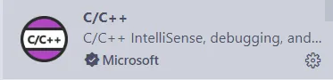

[w64devkit](https://github.com/skeeto/w64devkit/releases)
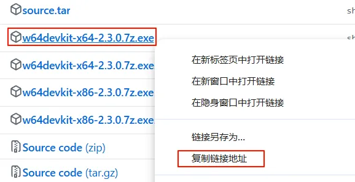
下载最新版本复制下载链接到这个[网站](https://xiake.pro/?ref=openi.cn)加速下载

下载后直接解压即可,复制bin文件夹的路径
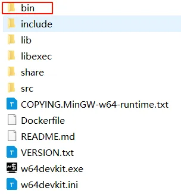
win+s搜索环境变量,在path路径配置路径
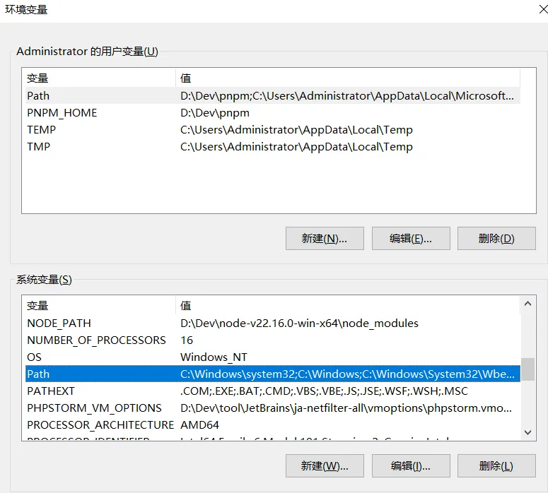
根据自己的路径来配
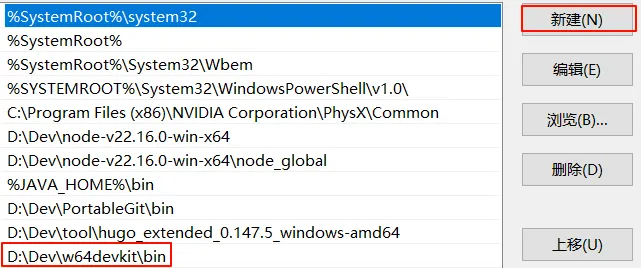
一直确定即可配置完毕.

cmd窗口输入 **`gcc -v`**

要是报错则是路径没配好

---
## 配置easyx
[easyx](https://easyx.cn/easyx)下载
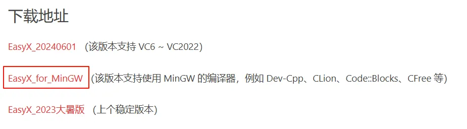

将下载的压缩包解压到一个空文件夹
```txt
easyx4mingw_xxxxxxxx.zip
	├ include <folder>
	│	├ easyx.h 				// 头文件(提供了当前最新版本的接口)
	│	└ graphics.h			// 头文件(在 easyx.h 的基础上，保留了若干旧接口)
	├ lib32 <folder>
	│	└ libeasyx.a			// 针对 TDM-GCC 4.8.1 及以上版本的 32 位库文件
	├ lib64 <folder>
	│	└ libeasyx.a			// 针对 TDM-GCC 4.8.1 及以上版本的 64 位库文件
	└ lib-for-devcpp_5.4.0
		└ libeasyx.a			// 适用于 DevCpp 5.4.0 GCC MinGW 4.7.2 和 C-Free 5.0

```
这是官网指南的文件目录

- 在vscode新建一个项目,新建.vscode文件夹,把easyx的**include**和**lib64**两个文件夹直接移入项目内
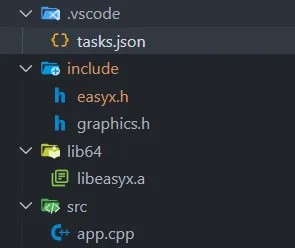
.vscode文件夹新建 tasks.json,参考如下,一定要把 **`"D:\\Dev\\w64devkit\\bin\\g++.exe"`** 换成自己的路径,也就是先前下载的 w64devkit下的bin文件夹下的g++.exe路径,记得分隔符是两个反斜杠或者一个正斜杠
```json
{
    "tasks": [
        {
            "type": "cppbuild",
            "label": "C/C++: g++.exe 生成活动文件",
            "command": "D:\\Dev\\w64devkit\\bin\\g++.exe",
            "args": [
                "-fdiagnostics-color=always",
                "-g",
                "-I${workspaceFolder}/include", // 指定头文件路径
                "-L${workspaceFolder}/lib64",     // 指定库文件路径
                "${file}",
                "-o",
                "${fileDirname}\\${fileBasenameNoExtension}.exe",
                "-leasyx", // 因为是第三方库需要指定链接
            ],
            "options": {
                "cwd": "${fileDirname}"
            },
            "problemMatcher": [
                "$gcc"
            ],
            "group": {
                "kind": "build",
                "isDefault": true
            },
            "detail": "调试器生成的任务。"
        }
    ],
    "version": "2.0.0"
}
```
- 然后src目录新建一个app.cpp文件
```cpp
#include <graphics.h>
#include <conio.h>

int main()
{
	initgraph(640, 480);
	circle(320, 240, 100);
	_getch();
	return 0;
}
```
接下来进入cpp文件窗口,因为安装了vscode扩展所以右上角有小三角,点击后一切无误即可运行
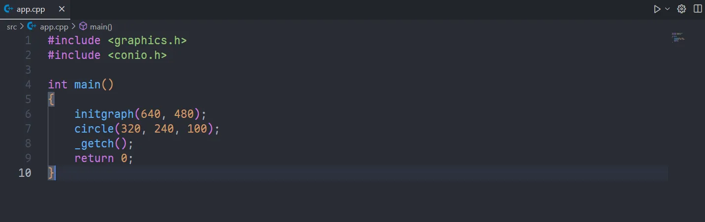
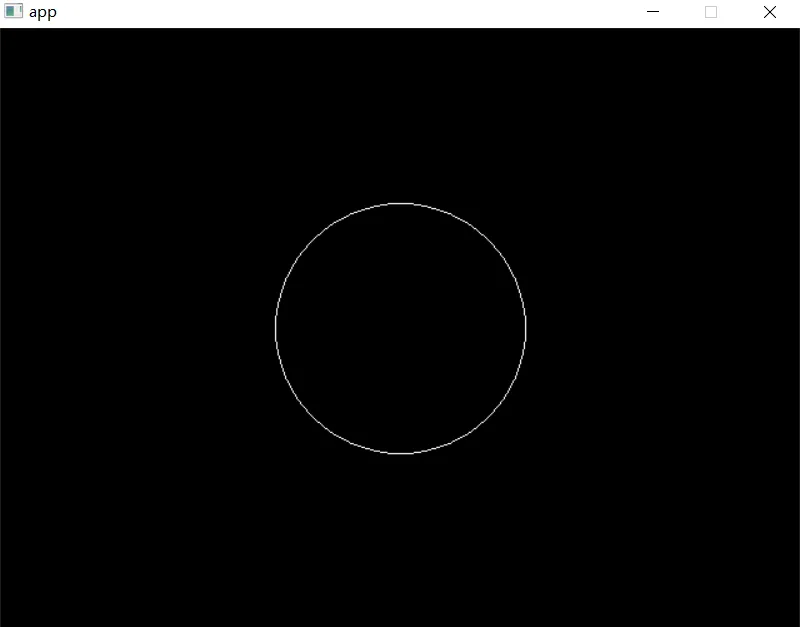
## 配置raylib
- 进入[网站](https://github.com/raysan5/raylib/releases)借助先前的加速网站下载

解压后
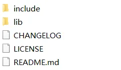
同样是新建一个项目,新建一个.vscode文件夹,再把raylib的 **include和lib**直接弄过去,.vscode新建一个tasks.json文件,新建src目录并在其里面新建一个app.cpp,再把lib下的raylib.dll移入src目录
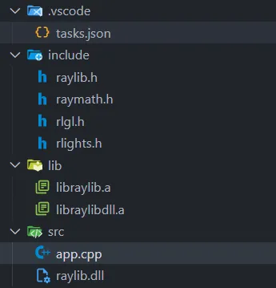

```json
{
    "tasks": [
        {
            "type": "cppbuild",
            "label": "C/C++: g++.exe 生成活动文件",
            "command": "D:\\Dev\\w64devkit\\bin\\g++.exe",
            "args": [
                "-fdiagnostics-color=always",
                "-g",
                "-I${workspaceFolder}/include", // 指定头文件路径
                "-L${workspaceFolder}/lib",     // 指定库文件路径
                "${file}",
                "-o",
                "${fileDirname}\\${fileBasenameNoExtension}.exe",
                "-lraylibdll", //动态链接参数
                // "-lraylib",静态链接参数要三个
                // "-lgdi32",
                // "-lwinmm",
            ],
            "options": {
                "cwd": "${fileDirname}"
            },
            "problemMatcher": [
                "$gcc"
            ],
            "group": {
                "kind": "build",
                "isDefault": true
            },
            "detail": "调试器生成的任务。"
        }
    ],
    "version": "2.0.0"
}
```
- 和easyx配置差不多,但是要注意 **"-lraylibdll"**这个参数,和先前的 **"-leasyx"** 有所区别,看目录也知道raylib的lib文件夹有两个 **.a文件**
 
  - libraylib.a是静态链接库
  - libraylibdll.a是动态链接库
- "-lraylibdll"是动态链接时的参数 
- 但是静态链接就需要"-lraylib","-lgdi32","-lwinmm",三个参数加在json文件里,后面两个是系统的dll
> 静态链接会把全部代码打包到exe文件,动态链接则需要借助raylib.dll所以exe文件较小且dll文件需要和exe文件同目录

```cpp
#include "raylib.h"
int main() {
InitWindow(800, 450, "Demo");
SetTargetFPS(60);
while (!WindowShouldClose()) {
BeginDrawing();
ClearBackground(RAYWHITE);
DrawText("Hello, raylib!", 190, 200, 20, BLACK);
EndDrawing();
}
CloseWindow();
return 0;
}
```
运行
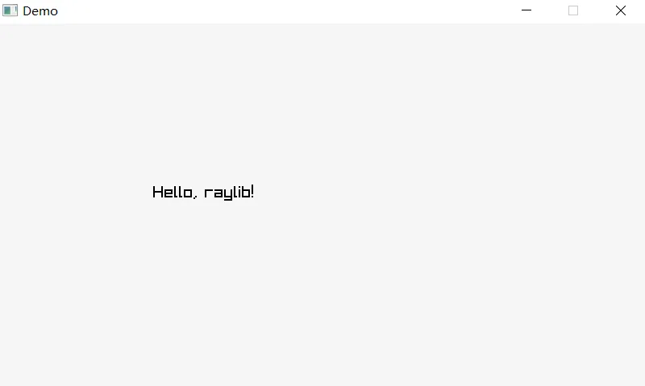
